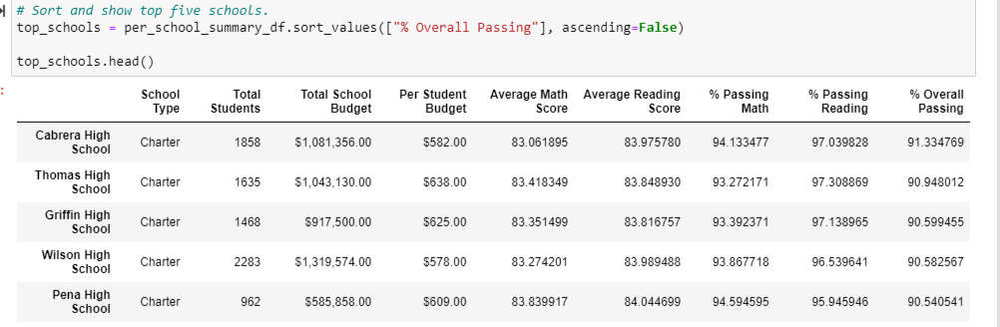
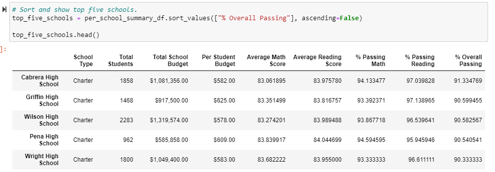

# School_District_Analysis
## Overview
The purpose of this analysis was to present a high-level snapshot of the district's key metrics, and correct academic dishonesty. The following is provided in an updated table:
-Top 5 and bottom 5 performing schools, based on the overall passing rate
-The average math score received by students in each grade level at each school
-The average reading score received by students in each grade level at each school
-School performance based on the budget per student
-School performance based on the school size 
-School performance based on the type of school

## Results

### How the District Summary is Affected
- There was not a large affect on the district summary. The Total students decreased, and there was a slight decrease in average math score, % passing math, % passing reading, and % overall passing. 
### How the School Summary is Affected
- There were major changes in the school summary. Categories like % passing math, % passing reading, and % overall passing decreased by as lot. 
### After Removing Ninth Graders from Thomas High School
- After removing the ninth graders from Thomas High School, they were no longer one of the top 5 schools in the district.
- The following code allowed me to change the student count that fixed all of the tables
```
Thomas_High_count = school_data_complete_df.loc[(school_data_complete_df["school_name"] == "Thomas High School") & (student_data_df["grade"] == "9th")].count()['student_name']


student_count = school_data_complete_df["Student ID"].count()


new_student_count = student_count - Thomas_High_count
```


## Summary
After updating the school district analysis 
1. The percentage of students passing math at Thomas High School decreased
2. The percentage of students passing reading at Thomas High School decreased
3. The overall percentage of students passing decreased for Thomas High School
4. Thomas High School dropped from the top 5 schools in the district. This is what it looked like before and after:
5.   
